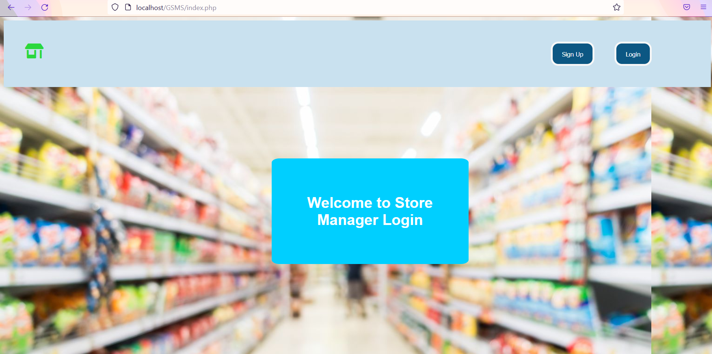
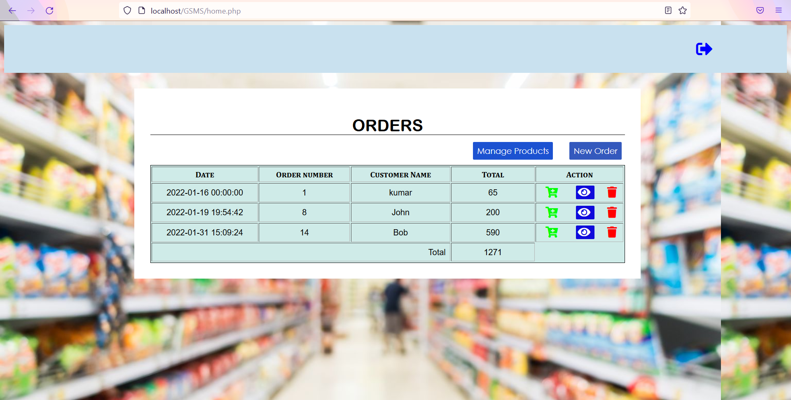
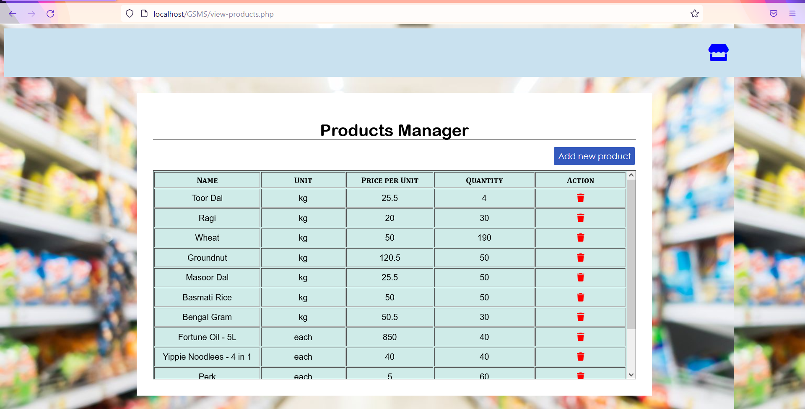
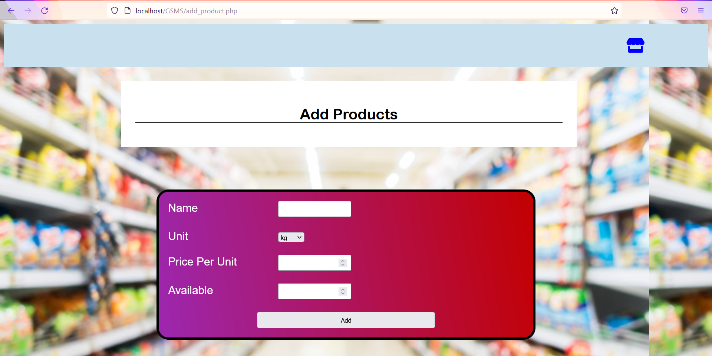
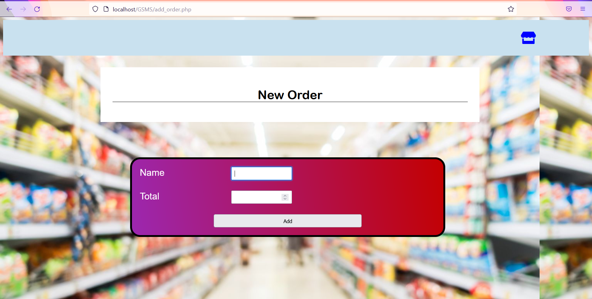
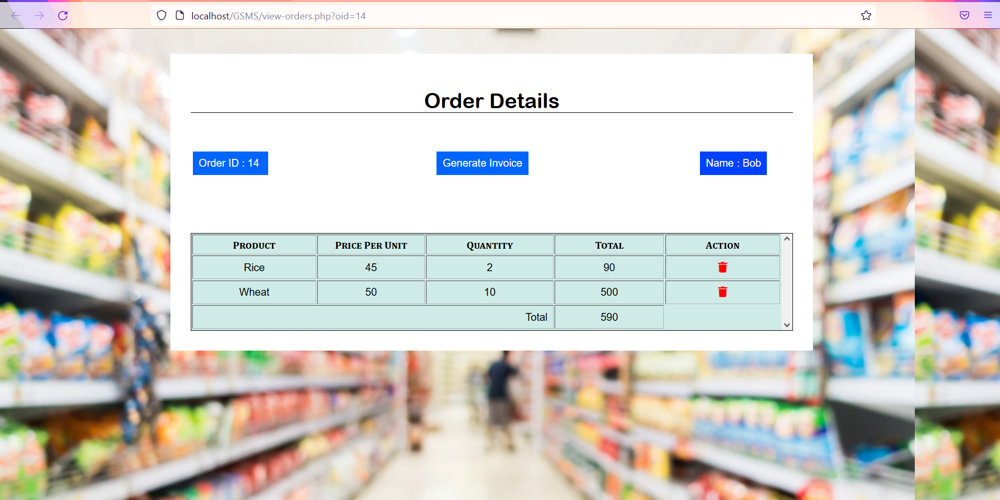
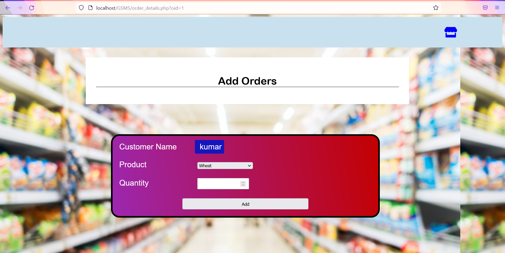
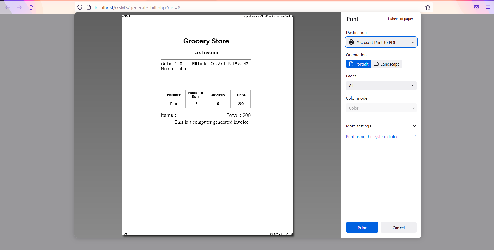

# Grocery Store Management System (GSMS)

GSMS is a system built for store managers who manage the products, orders, and bills of the store.

## Table of contents

- [Overview](#overview)
  - [Screenshot](#screenshot)
  - [Links](#links)
- [My process](#my-process)
  - [Built with](#built-with)

## Overview

### Screenshot 

### Links

- MySQL Docs : [Read the docs](https://dev.mysql.com/doc/)
- XAMPP : [ XAMPP download ](https://www.apachefriends.org/)

## My process

### Built with

- HTML5, CSS
- Apache Web Server
- MySQL
- PHP

